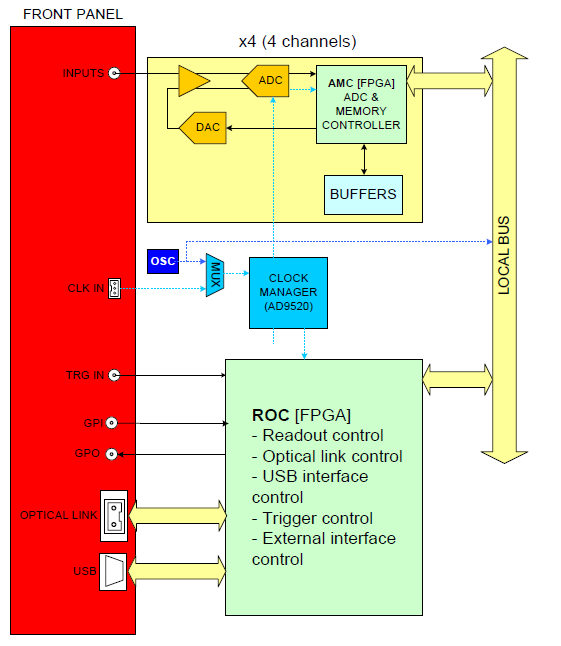
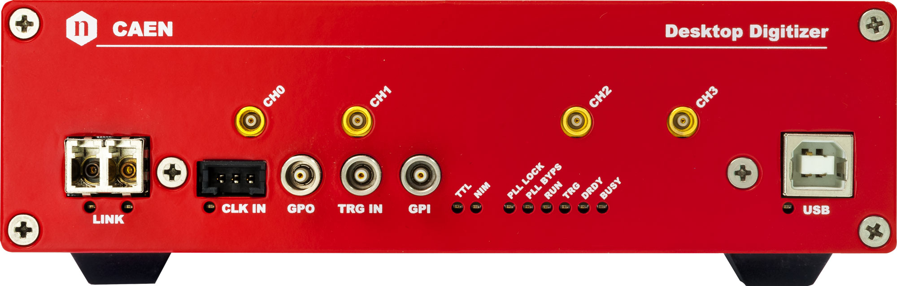
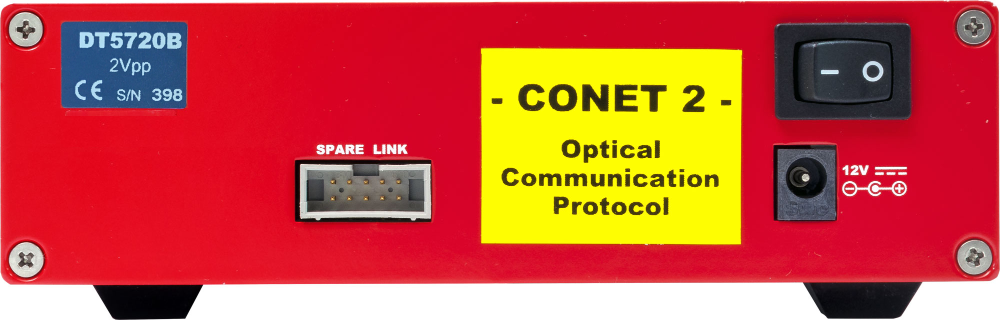

# DT5720_UserManual

>- User Manual UM3244
>- rev10
>- 2017.05.26 
>- 2/4 Channel 12bit 250MS/s Digitizer

## 目的

1. 完整硬件描述
2. 作为波形记录数字化仪Waveform Recording Digitizer（后称波形记录固件Waveform recording firmware）的工作原理

firmware version: 4.14_0.14

- 寄存器的去看 UM5961 – 720 Registers Description.
- DPP(Digital Pulse Processing) firmware，去看  UM2088 – DPP-PSD User Manual.

## 符号

ADC 	   Analog-to-Digital Converter
AMC 	  ADC & Memory Controller
DAQ 	  Data Acquisition
DAC 	   Digital-to-Analog Converter
DC 		 Direct Current
LVDS 	 Low-Voltage Differential Signal
PLL 		Phase-Locked Loop
ROC 	   ReadOut Controller
TTT 		Trigger Time Tag
USB 	   Universal Serial Bus

## Introduction

DT5720: 2/4 Channel 12 bit 250 MS/s Desktop Waveform Digitizer with 2 Vpp input dynamic range

(Vpp： 峰峰值，最大正弦值 - 最小正弦值)

（MS/s: S=sample s=second M=10^6 表示每秒钟的采样数）

**Considering the sampling frequency and bit number, these digitizers are well suited for mid-fast signals**  as the ones coming from liquid or inorganic scintillators coupled with PMTs or Silicon Photomultiplie

each channel is able to generate a self-trigger when the input signal goes under/over a programmable threshold.

During the acquisition, data stream is continuously written in a circular memory buffer.

Two modes are supported for the event storage in the board memories: Standard mode and Pack2.5 mode

The board houses USB 2.0 and optical link interfaces. USB 2.0 allows data transfers up to 30 MB/s.  The
Optical Link interface is capable of transfer rate up to 80 MB/s and offers daisy chain capability.

In addition to the waveform recording firmware, CAEN provides for this digitizer the Digital Pulse Processing firmware (DPP) for the Pulse Shape Discrimination (DPP-PSD) , which combines the functionalities of a digital QDC (charge integration) and discriminator of different shapes for particle identification.

## Block Diagram

## 技术规格

## Board Description

### Front Panel

| Connector         | Function                                                     |
| ----------------- | ------------------------------------------------------------ |
| CH0~CH3           | receive the input analog signals.                            |
| CLK IN            | Input and output connectors for the external clock.          |
| GPO               | General purpose programmable digital output connector to propagate: • the internal trigger sources; |
| TRG-IN            | Digital input connector for the external trigger.            |
| GPI               | General purpose programmable input connector.                |
| OPTICAL LINK PORT | Optical LINK connector for data readout and flow control. Daisy chainable. |
| USB PORT          | USB connector for data readout and flow control.             |
| DIAGNOSTICS LEDs  |                                                              |

### Rear Panel

| Connector         | Function                                                     |
| ----------------- | ------------------------------------------------------------ |
| SPARE LINK        | Auxiliary connector reserved for CAEN usage.                 |
| DC INPUT          | Input connector for the desktop Digitizer main power supply from the external AC/DC adapter. |
| IDENTIFYING LABEL | A blue label on the Desktop rear panel indicates             |

## Functional Description

### Analog Input Stage

Input dynamic is 2 Vpp. In order to preserve the full dynamic range with unipolar input signal, positive
or negative, it is possible to add a DC offset by means of a 16 bit DAC, which is up to +- 1 V.

### Clock Distribution

The clock distribution of the module takes place on two domains: OSC-CLK and REF-CLK.

OSC-CLK is a fixed 50-MHz clock coming from a local oscillator which handles USB, Optical Link and Local
Bus

### Trigger Clock

The TRG-CLK logic works at 125 MHz, equal to the sampling frequency: TRG-CLK = SAMPL-CLK.

### Acquisition Modes

#### Acquisition Run/Stop

有三种方式来Run/Stop

- 软件指定
- GPI signal
- TRG-IN，the first trigger pulse

#### Acquisition Triggering: Samples and Events

一个Event由 触发时间标识、触发前采样、触发后采样 和 事件计数组成。

”采集窗口“会发生重叠，这种重叠可以被拒绝也可以被接受，可以通过软件编程实现。

#### Multi-Event Memory Organization

每个通道都有单独的SRAM内存，内存可以再划分成不同数量的缓冲区。

自定义缓冲区大小直接影响采集窗口的宽度，CAEN中记录长度参数和CAENDigitizer库中的Set/GetRecordlength()函数都依赖于这些概念。

### Event structure

事件由Header和Data组成。数据格式32位字长

### Acquisition Synchronization

每个通道都有SRAM内存，内存分成多个缓冲区，当trigger发生时，FPGA会进一步为post-trigger写入可编程数量的样本并冻结缓冲区，以便存储的数据可以通过USB或Optical Link读取。Acquisiton可以在新的缓冲区中继续进行。

所有buffer都写满之后，board被认为时Full，这时候不能再被写入，并停止采集，直到有一个buffer被读出，此时board推出full。

## Zero Suppression

x720可以根据 Zero Suppression去选择事件，Zero Suppression允许用户以只传输有用数据的方式来减少数据传输的数据量。但是Zero Suppression在读出数据时起作用，所有存在延迟，并且所有的事件必须使用相同的trigger，由FPGA分析满足条件的事件并传输它。

### Full Suppression based on the Amplitude of the Signal

两种方法丢弃数据

1. 信号没有超过了阈值至少N秒
2. 信号没有超过阈值

阈值Tamp和Ns是个人设置的，Novt是实际超过阈值的时间，Novt > Ns，事件被获取。

